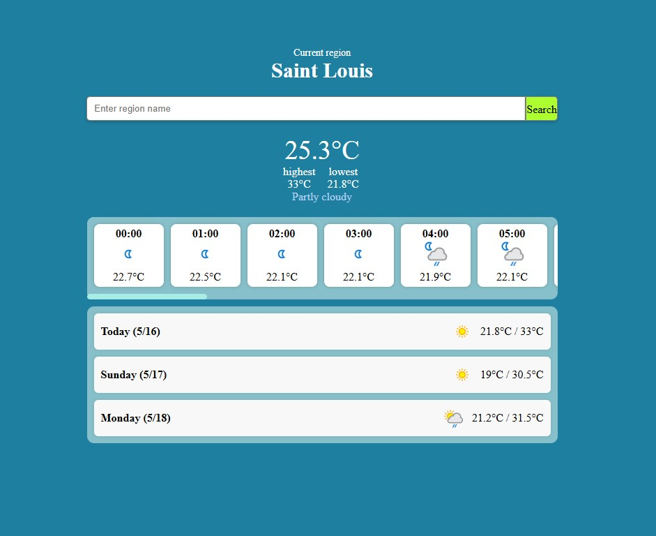

# Weather Forecast Web App

A small personal weather forecast project built with HTML, CSS, and JavaScript using the WeatherAPI service.

This project allows users to search for different cities and view:
- Current weather information
- Hourly weather forecast
- Multi-day weather forecast

The interface includes a horizontally scrollable hourly forecast section, responsive layout design, and dynamic weather icons provided by the API.

Through this project, I practiced:
- Fetching and processing API data
- JavaScript DOM manipulation
- Responsive web layout using Flexbox
- Building interactive UI components
- Handling time zones and date formatting

Technologies used:
- HTML
- CSS
- JavaScript
- WeatherAPI